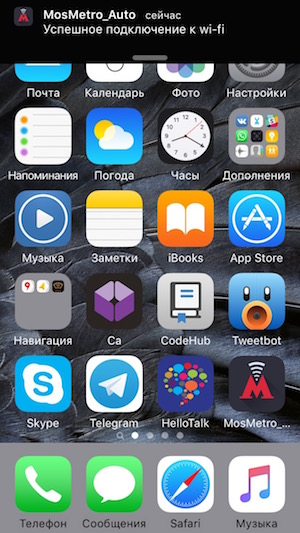

# MosMetro_Auto

Приложение созданно для автоматического входа в wi-fi московского метро.
Идея реализовать постоянную работу в фоне с низким потреблением энергии и автоматически подключаться входить в сеть.

На данный момент уже есть работа в фоне, но не более 3-10 минут.
Пока использую так: спускаясь в метро включаю прогу и блокирую телефон, в вагоне он уже сам подключается и оповещает об этом

